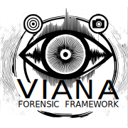

========================
VIANA Forensic Framework
========================

.. image:: https://pyup.io/repos/github/eniocc/viana_ff/shield.svg
     :target: https://pyup.io/repos/github/eniocc/viana_ff/
     :alt: Updates

A comprehensive framework designed for forensic analysis of video, image, and audio data, powered by neural networks. VIANA Forensic Framework provides tools for the automated and assisted identification, authentication, and enhancement of multimedia evidence, leveraging state-of-the-art machine learning techniques. Ideal for professionals working in digital forensics, security, and law enforcement, this framework offers an efficient and scalable solution for analyzing media with precision and accuracy.

Features
--------
- [ ] Task 1
    - [ ] Subtask 1.1
    - [ ] Subtask 1.2
        - [x] Subtask 1.2.1 (completed)
        - [ ] Subtask 1.2.2
    - [ ] Subtask 1.3
- [x] Task 2 (completed)
    - [x] Subtask 2.1 (completed)
    - [ ] Subtask 2.2

VIANA Forensic Framework License (VIANA - FFL)
----------------------------------------------
*Version 1.0, September 2024*

This software, **VIANA Forensic Framework**, is licensed under the Creative Commons Attribution-NonCommercial 4.0 International License (CC BY-NC 4.0). By using this software, you agree to the following terms:

1. **Attribution**: You must give appropriate credit, provide a link to the license, and indicate if changes were made. You may do so in any reasonable manner, but not in any way that suggests the licensor endorses you or your use. Proper credit must be attributed to Ênio Viana as the original creator.

2. **Non-Commercial Use**: You are free to use, modify, and share this software for non-commercial purposes only. Commercial use, including the sale or distribution of modified or unmodified versions of this software, is strictly prohibited unless prior written permission is obtained from the creator.

3. **No Derivatives for Commercial Use**: Modifications of this software may not be used for commercial purposes, nor may the original or modified software be sold or distributed commercially without explicit permission from the owner.

4. **Contact for Commercial Use**: To seek permission for commercial use, please contact Ênio Rodrigues Viana for licensing options and terms.

5. **No Warranty**: This software is provided "as-is" without any warranty or liability. The creator is not responsible for any damages or issues arising from the use of this software.

For the full legal text of this license, please visit the following link:

* `Creative Commons License (CC BY-NC 4.0) <https://creativecommons.org/licenses/by-nc/4.0/>`_

Credits
-------
This package was created by Ênio Viana
This package was created with Cookiecutter_ and the `audreyr/cookiecutter-pypackage`_ project template.

.. _Cookiecutter: https://github.com/audreyr/cookiecutter
.. _`audreyr/cookiecutter-pypackage`: https://github.com/audreyr/cookiecutter-pypackage
